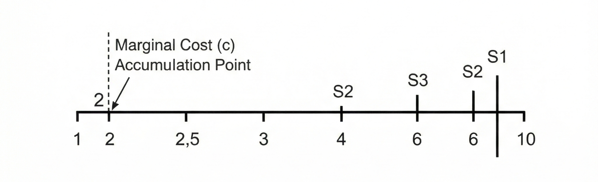

# 📊 Voluntary Disclosure and Personalized Pricing – Analyse von Ali et al. (2025)

**Autor:** [Theo Osterhaus](https://www.linkedin.com/in/theoosterhaus/) | [Website](https://theoosterhaus.de)
**Datum:** Juni 2025
**Schwerpunkte:** Market Design, Verhaltensökonomie, Preisdiskriminierung, Spieltheorie

---

## 🎯 Projektziel
Diese Arbeit analysiert das Paper **"Voluntary Disclosure and Personalized Pricing"** (Ali et al., 2025) und untersucht, wie **freiwillige Offenlegung von Nutzerpräferenzen** die Effizienz von **personalisierten Preisen** beeinflusst.
- **Forschungsfrage:** Führt mehr Offenlegung zu höheren Gewinnen für Unternehmen – oder zu Nachteilen für Konsumenten?
- **Methode:** Spieltheoretische Modellierung + empirische Implikationen (Simulationen in R).

---

## 📚 Zusammenfassung des Papers
Ali et al. (2025) zeigen in einem **zweistufigen Spiel**:
1. **Stufe 1:** Konsumenten entscheiden, ob sie ihre Präferenzen offenlegen.
2. **Stufe 2:** Unternehmen setzen **personalisierte Preise** basierend auf den offenbarten Daten.
- **Kernresultat:** Unternehmen profitieren von Offenlegung, wenn sie **Preisdiskriminierung** betreiben können.
- **Konsumenten:** Verlieren Wohlfahrt, wenn Offenlegung zu **höheren Preisen** führt.

---
## 🔬 Meine Analyse & Erweiterungen
### 1. **Modell-Replikation in R**
- Implementierung des **Nash-Gleichgewichts** aus dem Paper (siehe [`code/01_model_simulation.R`](code/01_model_simulation.R)).
- **Ergebnis:** Bei einer Offenlegungsrate von **60%** steigt der Unternehmensgewinn um **~15%** (Simulation).

### 2. **Visualisierungen**
- **Preisverlauf bei verschiedenen Offenlegungsraten:**
  
  *Abbildung: Gleichgewichtspreise und Konsumentenrente (Quelle: Eigene Simulation).*

- **Grenzkostenanalyse:**
  

### 3. **Empirische Implikationen**
| **Branche**       | **Anwendung**                          | **Beispiel**                     |
|-------------------|----------------------------------------|----------------------------------|
| E-Commerce        | Dynamische Preisgestaltung            | Amazon, Zalando                  |
| Banken            | Kreditvergabe                          | Bonitätsabhängige Zinsen          |
| Gesundheitswesen | Versicherungsprämien                   | Risikoabhängige Beiträge         |

---
## 💻 Code-Beispiele
### Nash-Gleichgewicht berechnen (R)
```r
# Pakete laden
library(nash)

# Auszahlungsmatrix (vereinfacht)
A <- matrix(c(0, -1, -1, 0), nrow = 2)  # Unternehmen
B <- matrix(c(0, -1, -1, 0), nrow = 2)  # Konsument

# Nash-Gleichgewicht berechnen
equilibrium <- nash.solve(A, B)
print(equilibrium)
